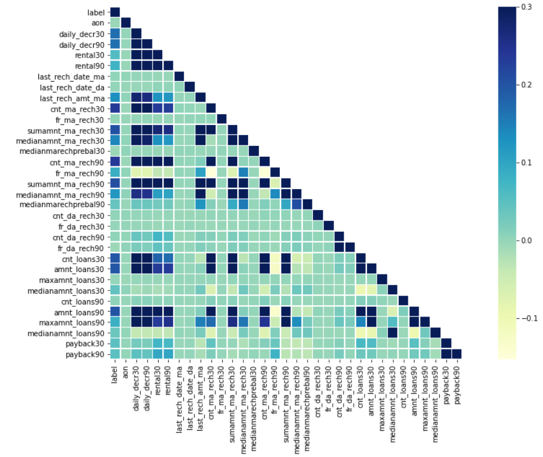

# Delinquency Model
It is a condition when a person is unable to do an expected activity at its scheduled time. Our study relates to the prediction of loan transactions whether a customer will pay back the loan on its scheduled time or not. It also includes how different parameters affect delinquency.

### Heat Map
Heat map shows the relation between features and its magnitude using the column bar.

### Data Analysis
No doubt, delinquency depends upon the various factor, some of these factors are discussed below.
Open the [https://nbviewer.jupyter.org/github/yesdeepakmittal/delinquencymodel/blob/main/DelinquencyModel.ipynb](#notebook) or visit [https://yesdeepakmittal.github.io/delinquencymodel/](# webpage)

